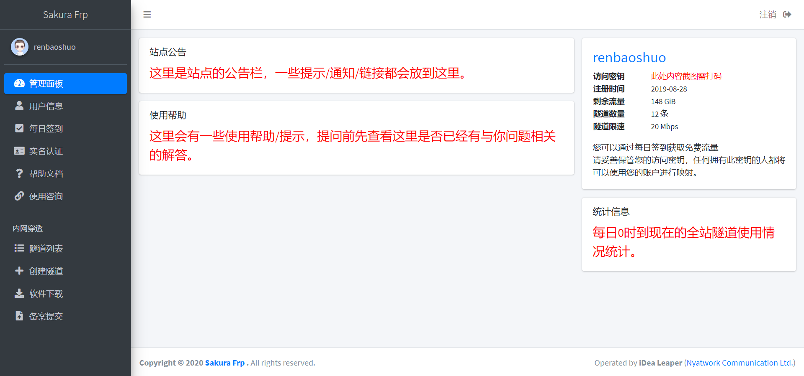
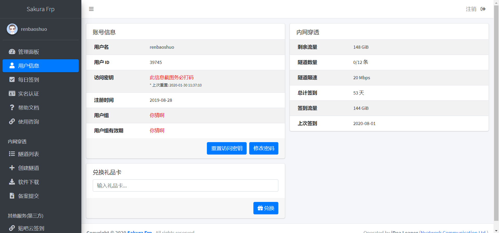
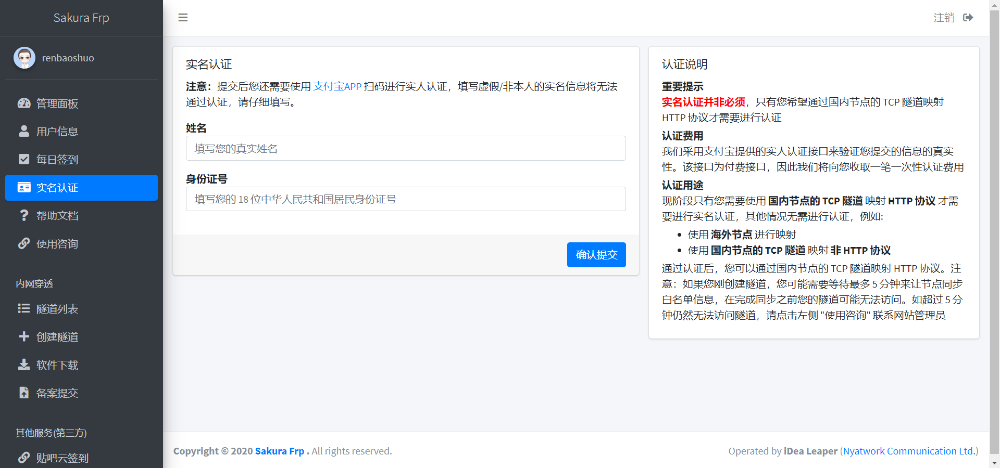

# Sakura Frp 管理面板介绍

## 首页

左侧部分为管理面板页面导航，右侧分别为 `站点公告` `使用帮助` `账户信息` `统计信息（全站）` 四个功能板块。

### 站点公告

一些提示、通知、帮助链接都会在此处展示。

在 v3.0α 版本中，为了手机用户的体验，`站点公告` 板块移动至页面左侧（如图所示），如果用户使用手机等窄屏设备访问，将最先看到公告。

### 使用帮助

一些帮助信息，部分热门问题会在此处给出解答。

### 账户信息

账户的信息，内容和 [`用户信息`](#用户信息) 页面中的 [`账号信息`](#账号信息) 板块相似。

### 统计信息

全站所有节点的流量、在线客户端实时统计。

## 用户信息

左侧部分依旧为管理面板页面导航，右侧分别为 `账号信息` `内网穿透` `兑换礼品卡` 三个功能板块。

### 账号信息

当前账号信息。

**访问密钥截图务必打码，由于不打码原因造成账号被盗后果自负。**

### 内网穿透

包含 `剩余流量` `可用隧道` `隧道限速` `总计签到` `签到流量` `上次签到` 等信息。

### 兑换礼品卡

?> _TODO_ 此功能暂未开放，故不作讲解。

## 签到页面

?> _TODO_

## 实名认证

以下内容均以您欲使用国内节点为前提。

+ 如需在**非 80/443 端口上建站**，必须完成实名认证。
+ 如需在**80/443 端口上建站**，不必完成实名认证，只需在 “备案提交” 页面提交已备案域名即可。

## 隧道列表

?> _TODO_

## 创建隧道

?> _TODO_

## 软件下载

?> _TODO_

## 备案提交

?> _TODO_
