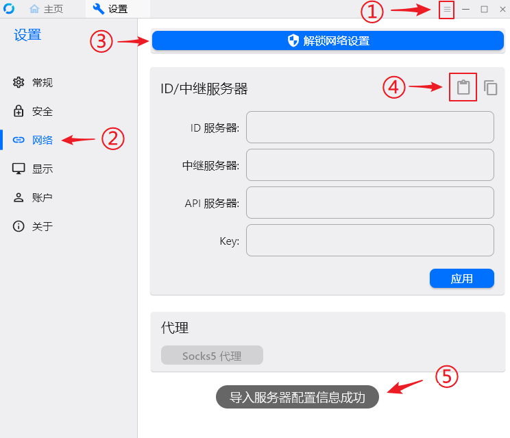
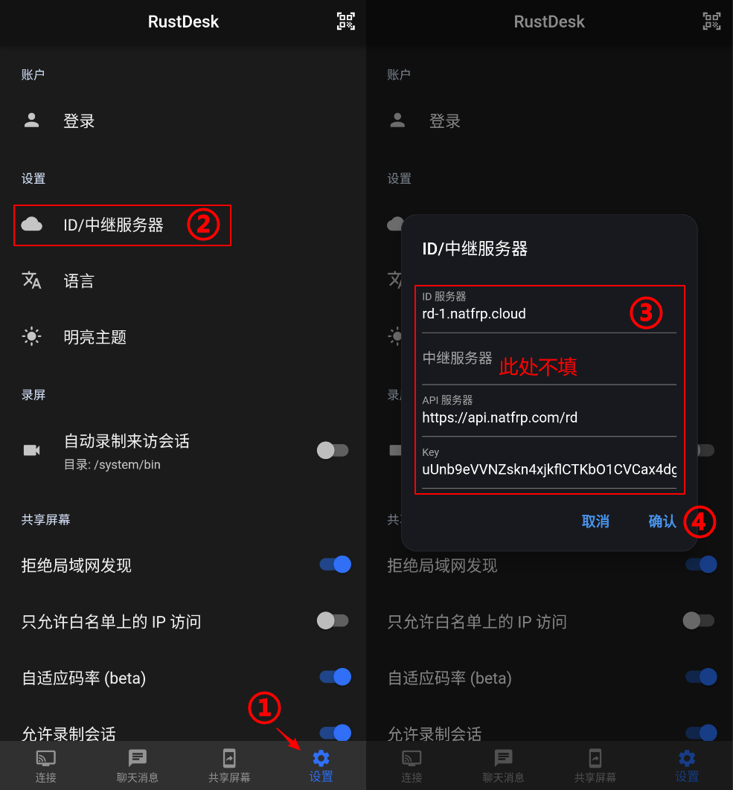
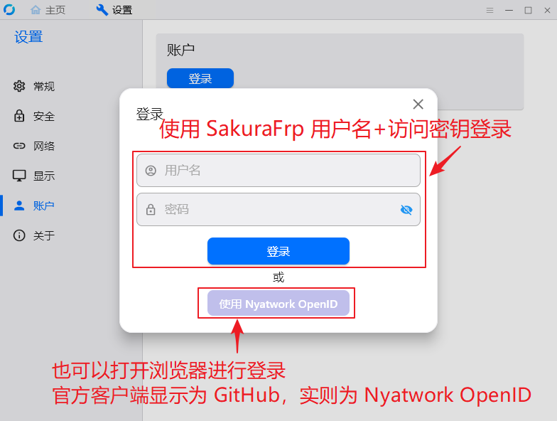

# 由 SakuraFrp 提供的 RustDesk 服务

::: danger 公开服务即将终止
为保证坚决彻底执行公安部《网络犯罪防治法（征求意见稿）》，避免出现执行不到位的情况给组织添乱，我们将下线 RustDesk 公共中继服务。

新客户端登录功能已关停，我们将于 2026/03/01 停止对现存 RustDesk 客户端的服务，请及时迁移至其他方案。
:::

RustDesk 是一款开源的远程桌面软件，支持多个主流平台。我们最初计划将其用于远程技术支持，由于其功能强大，目前也对 [部分用户](#eligible) 开放作为一个备用远程方案试用。

## 使用限制

::: danger
此服务主要被我们用于远程技术支持，并不保证长期提供。  
**所有** 策略可能在**任何时间**修改，请随时在本页查看策略更新。  
服务随时可能下线，请仅将其作为备用方案试用。  
使用本服务造成的**任何损失**，**无论任何原因**，我们概不负责。
:::

- **严禁** 将此服务用于非法控制他人设备、窃取信息、电信诈骗等非法用途
- 此服务可能因 DDoS 出现不可用的情况，**请不要作为唯一远程方案**
- **为了避免服务突然去世，不对红队用户开放**。建议使用其他知名远程桌面方案 😔
- 主控和被控都必须登录 [具有使用权限](#eligible) 的 SakuraFrp 账户
- 被控默认只接受登录了同一个账户的设备连接，如需授权其他人连接请在 [会话管理](https://www.natfrp.com/remote/rd_session) 界面配置可连接指定设备的 UID
- 目前普通用户可登录 5 个客户端，VIP 用户可登录 50 个客户端

## 资格说明 {#eligible}

自 2025-09-01 起，**已完成实名认证** 的用户均有 RustDesk 服务的使用权限。

## 下载软件

您可以选用 [SakuraFrp 分发的版本](https://github.com/natfrp/rustdesk/releases/latest) 或是 [RustDesk 官方发布的上游版本](https://github.com/rustdesk/rustdesk/releases/latest)。

- 由 SakuraFrp 分发的客户端无需配置服务器，且针对我们的服务进行了优化。  
  适合大部分用户使用，如果无法最正常下载可以尝试从 [Nyatwork CDN](https://nya.globalslb.net/natfrp/client/rustdesk/) 下载
- 官方版本需 [配置服务器](#configure) 才能正常连接 SakuraFrp 提供的 RustDesk 服务

::: tip 客户端兼容性说明
请使用 **1.2.0** 及以上版本的客户端进行连接，推荐您总是使用最新版客户端以获得最佳体验。
:::

## 配置指南 {#configure}

RustDesk 官方发布的客户端需配置 **ID/中继服务器** 以连接到 SakuraFrp。  
如果您使用的是由 SakuraFrp 分发的客户端 (底部显示 **正在使用由 SakuraFrp 提供的服务器**)，请 [跳过](#login) 这一步。

::: tabs

@tab 桌面客户端

1. 复制下方内容，请确保复制完整、没有多余字符（最右边有复制按钮）：
  
   ```base64
   9JSPRt2Z2IzQ5cnbrcGZ0gXYDZ1Qx8kYLR1QsZ2aqhHNut2ca5kVWVWOi5WV1JiOikXZrJCLiQmcv02bj5CcyZGdh5mLpBXYv8iOzBHd0hmI6ISawFmIsIiI6ISehxWZyJCLiQWdvx2YuAncmRXYu5SMtQmciojI0N3boJye
   ```

1. 转到 `RustDesk 设置 > 网络`，解锁网络设置后点击 `ID/中继服务器` 卡片右上角的导入按钮：

   

@tab Android / iOS 客户端

转到 `设置` 页面，点击右上角的扫码按钮扫描配置二维码：


这是一个简单的操作图示：



@tab 手动配置

将下列信息填写到 `ID/中继服务器` 设置中：

| 配置项 | 内容 |
| --- | --- |
| ID 服务器 | `rd-1.natfrp.cloud` |
| API 服务器 | `https://api.natfrp.com/rd` |
| Key | `uUnb9eVVNZskn4xjkflCTKbO1CVCax4dg+nw9C26gkQ=` |

请确保 **复制粘贴** 所有内容，避免因输入错误而无法连接。

:::

## 登录客户端 {#login}

点击下面的 `使用 Nyatwork OpenID`（官方客户端 < 1.2.2 显示为 `使用 GitHub`）按钮打开浏览器进行登录。



登录完成后，就可以正常使用 RustDesk 远程连接您的设备了。您只能连接登录了同一个账户或被授权访问的设备。

修改密码不会踢掉 RustDesk 会话，如有相关需求请前往 [会话管理](https://www.natfrp.com/remote/rd_session) 页面进行操作。

## 常见问题 {#faq}

### “正在连接” 一段时间后提示连接错误，点击中继连接可正常使用 {#faq-relay-connection}

这是由于官方版本无论 NAT 类型如何均会尝试进行直连，建议更换由 SakuraFrp 提供的客户端。

您也可以在设备 ID 后加上 `/r` 强制走中继服务器连接，例如设备 ID 为 `11222333` 时，输入 `11222333/r` 进行连接。

### 会话管理页面设备信息显示未知 {#faq-unknown-device}

请确认您使用的是最新版客户端，您也可以尝试用用户名 + 访问密钥登录来立即更新设备信息。

### 设备 ID 或 UUID 被其他账户占用 {#faq-device-id-conflict}

这种情况常见于一些配置不当的虚拟机模版在克隆时未重新生成机器码，导致您的会话与其他用户产生冲突。

**设备 ID** 由网卡 MAC 地址派生，通常不会发生重复。**UUID** 由 [machine_uid](https://docs.rs/machine-uid/latest/machine_uid/) 提供，请参考下方信息重新生成。

::: warning 警告
重新生成 UUID 可能产生预期外的后果，请在重新生成前备份旧的 UUID，以便在出现问题时回滚
:::

::: tabs

@tab Windows

1. 按 `Win-R` 打开运行对话框，输入 `regedit` 打开注册表编辑器
1. 转到 `HKEY_LOCAL_MACHINE\SOFTWARE\Microsoft\Cryptography`
1. 备份 `MachineGuid` 项的值
1. 删除 `MachineGuid` 项
1. 重启计算机

@tab Linux

若 `/var/lib/dbus/machine-id` 存在，以 `root` 权限执行下列命令：

```bash
cat /etc/machine-id /var/lib/dbus/machine-id
# 备份上面的输出内容

rm -f /etc/machine-id /var/lib/dbus/machine-id
dbus-uuidgen --ensure=/etc/machine-id
ln -s /etc/machine-id /var/lib/dbus/machine-id
```

否则，以 `root` 权限执行下列命令：

```bash
cat /etc/machine-id
# 备份上面的输出内容

uuidgen | sed 's/-//g' > /etc/machine-id
```

:::

### RustDesk 服务是否消耗流量 {#faq-traffic-billing}

通过 SakuraFrp 提供的节点进行连接时会消耗账户流量，且传输限速与账户限速一致。

RustDesk 的流量消耗通常很小，基本可以忽略。传输文件、映射端口时才会产生较为明显的流量消耗。

如果您的账户中有 **RD 流量包** 则优先扣除该流量包，否则会扣除账户中的其他流量包，扣除规则与普通的 frp 流量相同。

### 开始连接后不到几秒就弹出 Timeout 错误 {#faq-timeout}

您可能使用的是 2023.07.01 之前构建的 Nightly 版本，请更新客户端。

### Android / iOS 客户端设置 API 服务器时提示 invalid port value {#faq-invalid-port-value}

该问题已于 `1.2.0` 版本被修复，请更新客户端。
