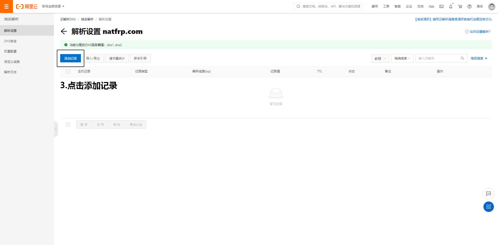

# 如何进行SRV解析

鉴于有很多用户都不会用百度查询如何进行**SRV解析**，所有就有了这个文档

本文档会教您如何在 [阿里云](#阿里云)/[Cloudflare](#Cloudflare) 上进行**SRV解析**

如果您有**其他厂商**的域名，并且会在该平台进行**SRV解析**，欢迎增加

您如果要进行**SRV解析**，您就必须要有一个域名，本文档不会推荐您使用哪个厂商的域名，如果您**不会花钱**的话，那我们也没办法了

!> 部分图片截图因为需要保护隐私/更好的展示，所以使用了开发者工具进行修改

## 阿里云

点击[这里](https://dc.console.aliyun.com/next/index#/domain/list/all-domain)进入**阿里云**的**域名列表**，如果您**没有登录**，请登录

找到您想要进行**SRV解析的域名**，点击**最后一栏**操作中的解析

点击**添加记录**

然后按照**以下格式**进行**填写**

| 记录类型 | SRV                                                          |
| -------- | ------------------------------------------------------------ |
| 主机记录 | `_服务的名字._协议的类型.域名前缀`                           |
| 记录值   | **0 5 远程端口 隧道域名**，例如：**0 5 xxxxx cn-xx-xxx.sakurafrp.com** |

最后点击**确认**即可

然后需要**等待**10min（按照您**设置的TTL**来决定，一般为10min）

**假设**您的域名为：natfrp.com，您的**域名后缀**设置为test，那么使用test.natfrp.com即可连接到您的服务

如果您要对**MC服务**进行**SRV解析**，那么就按照**以下格式**填写即可（我猜大部分用户使用**SRV解析**都是因为MC服务吧）

|          |                                             |
| -------- | ------------------------------------------- |
| 记录类型 | SRV                                         |
| 主机记录 | `_minecraft._tcp.xx` （后面的XX可以自定义） |
| 记录值   | 0 5 远程端口 隧道域名                       |

## Cloudflare

点击[这里](https://dash.cloudflare.com/)进入**Cloudflare**的**域名列表**，如果您**没有登录**，请登录

找到您想要进行**SRV解析**的域名并且**点击它**

然后点击最顶上的**第三个** DNS

点击**添加记录**

按照**以下格式**填写即可

|        |                      |
| ------ | -------------------- |
| 类型   | SRV                  |
| 名称   | _服务的名字          |
| 协议   | TCP/UDP/TLS          |
| 优先级 | 0-65535（建议65535） |
| 权重   | 0-65535（建议65535） |
| 端口   | 远程端口             |
| 目标   | 隧道域名             |

最后点击**保存**

然后需要**等待一会**（按照**您设置的TTL**来决定）

**假设**您的域名为：natfrp.com，您的**域名后缀**设置为test，那么使用test.natfrp.com即可连接到您的服务

如果您要对**MC服务**进行**SRV解析**，那么就按照**以下格式**填写即可（我猜大部分用户使用**SRV解析**都是因为MC服务吧）

|        |            |
| ------ | ---------- |
| 类型   | SRV        |
| 名称   | _minecraft |
| 协议   | TCP        |
| 优先级 | 65535      |
| 权重   | 65535      |
| 端口   | 远程端口   |
| 目标   | 隧道域名   |

